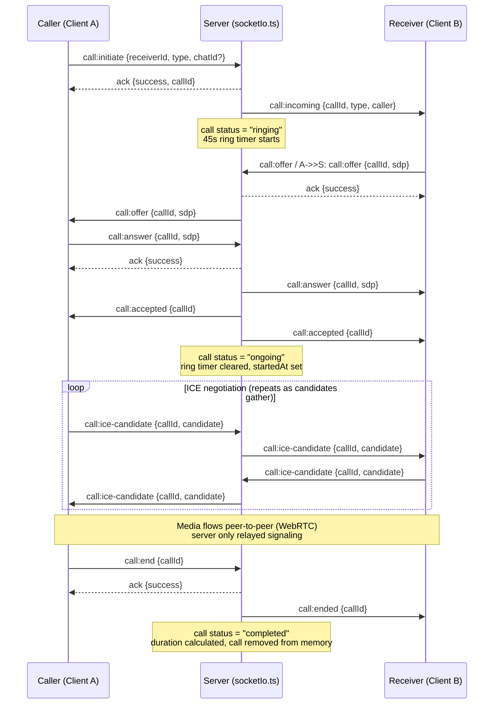
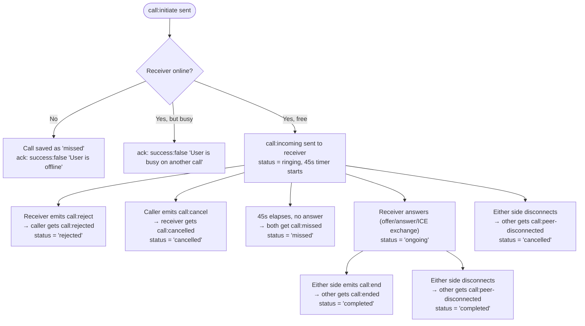
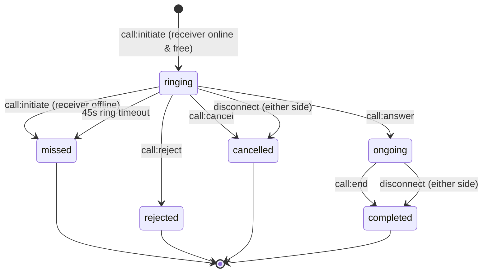

# Audio / Video Call — Socket.IO Events (Postman Socket.IO client)

Source: [socketIo.ts:369-613](../src/socketIo.ts#L369-L613)

## Frontend Integration — what to emit vs. listen for

### Events the client must **emit**

| Event | When to emit | Payload |
|---|---|---|
| `call:initiate` | User taps call button | `{ receiverId, type: "audio"\|"video", chatId? }` |
| `call:offer` | After `getUserMedia` + `RTCPeerConnection` created, once local SDP offer is set (whichever side creates the offer — typically the caller after receiving `call:accepted` is NOT needed; offer can be sent right after `call:incoming`/right after `call:initiate` ack) | `{ callId, sdp: offerSdp }` |
| `call:answer` | Receiver accepts the incoming call UI and sets local SDP answer | `{ callId, sdp: answerSdp }` |
| `call:ice-candidate` | Every time the local `RTCPeerConnection.onicecandidate` fires | `{ callId, candidate }` |
| `call:reject` | Receiver taps "Decline" on incoming call UI | `{ callId }` |
| `call:cancel` | Caller taps "Cancel" while still ringing (before answered) | `{ callId }` |
| `call:end` | Either side taps "Hang up" during ringing or ongoing call | `{ callId }` |

All seven are emitted **with an ack callback** — always handle it (`success`/`message`) to show errors (e.g. "User is offline", "Call not found").

### Events the client must **listen for**

| Event | Fired when | What UI should do |
|---|---|---|
| `call:incoming` | Someone is calling this user | Show incoming-call screen with caller info; start local ringtone |
| `call:offer` | Other party's SDP offer arrives | `setRemoteDescription(offer)`, create answer, then emit `call:answer` |
| `call:answer` | Other party's SDP answer arrives | `setRemoteDescription(answer)` |
| `call:accepted` | Call has been answered (both sides) | Stop ringing UI, switch to in-call UI, start call timer |
| `call:ice-candidate` | Other party's ICE candidate arrives | `addIceCandidate(candidate)` |
| `call:rejected` | Receiver declined | Show "Call declined", close call UI, stop outgoing ring tone |
| `call:cancelled` | Caller cancelled before answer | Dismiss incoming-call screen, stop ringtone |
| `call:missed` | No answer within 45s | Show "Missed call" / "No answer", close call UI |
| `call:ended` | Other party hung up | Close call UI, stop media tracks, tear down `RTCPeerConnection` |
| `call:peer-disconnected` | Other party's socket dropped (network loss, app killed) | Treat like `call:ended`/`call:missed`; close call UI, tear down connection |

Every listener that ends the call screen should also: stop all local media tracks (`stream.getTracks().forEach(t => t.stop())`) and call `peerConnection.close()`.

### Minimal client skeleton (socket.io-client + WebRTC)

```js
import { io } from "socket.io-client";

const socket = io(SERVER_URL, { auth: { token: jwt } });
let pc; // RTCPeerConnection
let localStream;
let currentCallId;

// ---- Emit side ----
function startCall(receiverId, type, chatId) {
  socket.emit("call:initiate", { receiverId, type, chatId }, async (res) => {
    if (!res.success) return showError(res.message);
    currentCallId = res.callId;
    await setupPeerConnection();
    const offer = await pc.createOffer();
    await pc.setLocalDescription(offer);
    socket.emit("call:offer", { callId: currentCallId, sdp: offer });
  });
}

function answerCall(callId) {
  currentCallId = callId;
  // pc gets created inside the call:offer handler below,
  // then call:answer is emitted from there once local answer is set.
}

function rejectCall(callId) {
  socket.emit("call:reject", { callId });
}

function cancelCall(callId) {
  socket.emit("call:cancel", { callId });
}

function endCall(callId) {
  socket.emit("call:end", { callId });
  teardown();
}

async function setupPeerConnection() {
  localStream = await navigator.mediaDevices.getUserMedia({ audio: true, video: true });
  pc = new RTCPeerConnection({ iceServers: [{ urls: "stun:stun.l.google.com:19302" }] });
  localStream.getTracks().forEach((t) => pc.addTrack(t, localStream));
  pc.onicecandidate = (e) => {
    if (e.candidate) {
      socket.emit("call:ice-candidate", { callId: currentCallId, candidate: e.candidate });
    }
  };
  pc.ontrack = (e) => attachRemoteStream(e.streams[0]);
}

// ---- Listen side ----
socket.on("call:incoming", ({ callId, type, caller }) => {
  showIncomingCallUI({ callId, type, caller });
});

socket.on("call:offer", async ({ callId, sdp }) => {
  currentCallId = callId;
  await setupPeerConnection();
  await pc.setRemoteDescription(sdp);
  const answer = await pc.createAnswer();
  await pc.setLocalDescription(answer);
  socket.emit("call:answer", { callId, sdp: answer });
});

socket.on("call:answer", async ({ sdp }) => {
  await pc.setRemoteDescription(sdp);
});

socket.on("call:accepted", () => {
  showInCallUI();
});

socket.on("call:ice-candidate", async ({ candidate }) => {
  try { await pc.addIceCandidate(candidate); } catch (e) { console.error(e); }
});

socket.on("call:rejected", () => teardown("Call declined"));
socket.on("call:cancelled", () => teardown("Call cancelled"));
socket.on("call:missed", () => teardown("No answer"));
socket.on("call:ended", () => teardown("Call ended"));
socket.on("call:peer-disconnected", () => teardown("Connection lost"));

function teardown(message) {
  localStream?.getTracks().forEach((t) => t.stop());
  pc?.close();
  pc = null;
  currentCallId = null;
  closeCallUI(message);
}
```

## Call Workflow

### 1. Happy path — call connects and ends normally



### 2. Alternate branches (instead of step "A->>S: call:end")



### 3. Call status state machine (persisted via `callService`)



### Step-by-step (plain text)

1. **Initiate** — Caller emits `call:initiate`. Server validates (not self-call, not already in a call, receiver online, receiver not busy), creates a `Call` document, starts a 45s ring timer, and pushes `call:incoming` to the receiver.
2. **Signal** — Once the receiver's client is ready, an SDP `offer`/`answer` exchange happens over `call:offer` and `call:answer`, relayed 1:1 by the server. `call:answer` also flips call status to `ongoing`, clears the ring timer, and fires `call:accepted` to both sides.
3. **ICE exchange** — Both peers keep emitting `call:ice-candidate` as candidates are discovered; the server relays each to the other party until the peer-to-peer connection is established.
4. **Media** — Audio/video streams flow directly between the two clients (WebRTC peer connection); the server is not in the media path.
5. **Termination** — The call ends via exactly one of:
   - `call:end` (either side, while ringing or ongoing) → other side gets `call:ended`
   - `call:reject` (receiver, while ringing) → caller gets `call:rejected`
   - `call:cancel` (caller, while ringing) → receiver gets `call:cancelled`
   - ring timeout (45s, no answer) → both sides get `call:missed`
   - socket disconnect (either side, any state) → other side gets `call:peer-disconnected`
6. **Cleanup** — In every termination path the server clears the in-memory `activeCalls`/`userActiveCallId` entries and persists the final status (`completed`, `missed`, `rejected`, or `cancelled`) plus `endedAt`/`duration` where applicable.

## Connection setup (Postman)

- URL: `http://localhost:9020` (or `ws://<host>:<socket_port>`)
- Auth: send JWT in one of:
  - `handshake.auth.token`
  - header `token`
  - header `authorization`
- Namespace: `/` (default)

Postman → Socket.IO request → "Auth" tab → set `token` under Auth Payload (as `auth.token`), or add header `token: <JWT>`.

`type` is always one of: `"audio" | "video"` ([call.interface.ts:3](../src/app/modules/call/call.interface.ts#L3)).

---

## 1. `call:initiate` (emit, with ack)

Caller starts a call.

**Emit event name:** `call:initiate`

**Payload:**
```json
{
  "receiverId": "66f1a2b3c4d5e6f7a8b9c0d1",
  "chatId": "66f1a2b3c4d5e6f7a8b9c0aa",
  "type": "video"
}
```
- `chatId` optional.

**Ack callback response:**
```json
{ "success": true, "callId": "66f1a2b3c4d5e6f7a8b9c0ff" }
```
Failure cases (still via ack, `success: false`):
- `Unauthorized`
- `receiverId and type are required`
- `You cannot call yourself`
- `You are already in a call`
- `User is offline`
- `User is busy on another call`
- `Failed to initiate call`

**Server → Receiver, listen event:** `call:incoming`
```json
{
  "callId": "66f1a2b3c4d5e6f7a8b9c0ff",
  "chatId": "66f1a2b3c4d5e6f7a8b9c0aa",
  "type": "video",
  "caller": {
    "_id": "66f1a2b3c4d5e6f7a8b9c0cc",
    "name": "John Doe",
    "email": "john@example.com"
  }
}
```

**If unanswered within 45s (RING_TIMEOUT_MS), server emits to BOTH caller and receiver, listen event:** `call:missed`
```json
{ "callId": "66f1a2b3c4d5e6f7a8b9c0ff" }
```

---

## 2. `call:offer` (emit, with ack)

Either side sends SDP offer, relayed to the other party.

**Emit event name:** `call:offer`

**Payload:**
```json
{
  "callId": "66f1a2b3c4d5e6f7a8b9c0ff",
  "sdp": { "type": "offer", "sdp": "v=0\r\no=- ... (SDP string)" }
}
```

**Ack callback response:**
```json
{ "success": true }
```
or `{ "success": false, "message": "Call not found" }`

**Server → other party, listen event:** `call:offer`
```json
{
  "callId": "66f1a2b3c4d5e6f7a8b9c0ff",
  "sdp": { "type": "offer", "sdp": "v=0\r\no=- ..." }
}
```

---

## 3. `call:answer` (emit, with ack)

Receiver answers with SDP answer; marks call `ongoing`.

**Emit event name:** `call:answer`

**Payload:**
```json
{
  "callId": "66f1a2b3c4d5e6f7a8b9c0ff",
  "sdp": { "type": "answer", "sdp": "v=0\r\no=- ... (SDP string)" }
}
```

**Ack callback response:**
```json
{ "success": true }
```
or `{ "success": false, "message": "Call not found" }`

**Server → caller/receiver's other side, listen event:** `call:answer`
```json
{
  "callId": "66f1a2b3c4d5e6f7a8b9c0ff",
  "sdp": { "type": "answer", "sdp": "v=0\r\no=- ..." }
}
```

**Server → BOTH caller and receiver, listen event:** `call:accepted`
```json
{ "callId": "66f1a2b3c4d5e6f7a8b9c0ff" }
```

---

## 4. `call:ice-candidate` (emit, with ack)

Trickle ICE, relayed both ways. Emit multiple times as candidates are gathered.

**Emit event name:** `call:ice-candidate`

**Payload:**
```json
{
  "callId": "66f1a2b3c4d5e6f7a8b9c0ff",
  "candidate": {
    "candidate": "candidate:1 1 UDP 2122252543 192.168.1.5 54321 typ host",
    "sdpMid": "0",
    "sdpMLineIndex": 0
  }
}
```

**Ack callback response:**
```json
{ "success": true }
```
or `{ "success": false, "message": "Call not found" }`

**Server → other party, listen event:** `call:ice-candidate`
```json
{
  "callId": "66f1a2b3c4d5e6f7a8b9c0ff",
  "candidate": {
    "candidate": "candidate:1 1 UDP 2122252543 192.168.1.5 54321 typ host",
    "sdpMid": "0",
    "sdpMLineIndex": 0
  }
}
```

---

## 5. `call:reject` (emit, with ack)

Receiver declines a ringing call.

**Emit event name:** `call:reject`

**Payload:**
```json
{ "callId": "66f1a2b3c4d5e6f7a8b9c0ff" }
```

**Ack callback response:**
```json
{ "success": true }
```
or `{ "success": false, "message": "Call not found" }`

**Server → caller, listen event:** `call:rejected`
```json
{ "callId": "66f1a2b3c4d5e6f7a8b9c0ff" }
```

Call status is persisted as `rejected`.

---

## 6. `call:cancel` (emit, with ack)

Caller cancels before receiver answers.

**Emit event name:** `call:cancel`

**Payload:**
```json
{ "callId": "66f1a2b3c4d5e6f7a8b9c0ff" }
```

**Ack callback response:**
```json
{ "success": true }
```
or `{ "success": false, "message": "Call not found" }`

**Server → receiver, listen event:** `call:cancelled`
```json
{ "callId": "66f1a2b3c4d5e6f7a8b9c0ff" }
```

Call status is persisted as `cancelled`.

---

## 7. `call:end` (emit, with ack)

Either side ends a ringing or ongoing call.

**Emit event name:** `call:end`

**Payload:**
```json
{ "callId": "66f1a2b3c4d5e6f7a8b9c0ff" }
```

**Ack callback response:**
```json
{ "success": true }
```
or `{ "success": false, "message": "Call not found" }`

**Server → the other party, listen event:** `call:ended`
```json
{ "callId": "66f1a2b3c4d5e6f7a8b9c0ff" }
```

Call status is persisted as `completed` (if was `ongoing`) or `cancelled` (if was still `ringing`).

---

## 8. `call:peer-disconnected` (listen only, server-initiated)

Fired automatically when the other party's socket disconnects mid-call (no explicit emit needed from client).

**Listen event:** `call:peer-disconnected`
```json
{ "callId": "66f1a2b3c4d5e6f7a8b9c0ff" }
```

Underlying call is then finalized as `completed` (if it was `ongoing`) or `cancelled` (if still `ringing`) — see [socketIo.ts:109-120](../src/socketIo.ts#L109-L120).

---

## Full event summary table

| # | Client emits          | Ack response                          | Server emits (to)                          |
|---|------------------------|----------------------------------------|---------------------------------------------|
| 1 | `call:initiate`        | `{ success, callId }`                  | `call:incoming` (receiver), `call:missed` (both, on timeout) |
| 2 | `call:offer`           | `{ success }`                          | `call:offer` (other party)                  |
| 3 | `call:answer`          | `{ success }`                          | `call:answer` (other party), `call:accepted` (both) |
| 4 | `call:ice-candidate`   | `{ success }`                          | `call:ice-candidate` (other party)          |
| 5 | `call:reject`          | `{ success }`                          | `call:rejected` (caller)                    |
| 6 | `call:cancel`          | `{ success }`                          | `call:cancelled` (receiver)                 |
| 7 | `call:end`             | `{ success }`                          | `call:ended` (other party)                  |
| — | *(none — auto)*        | —                                       | `call:peer-disconnected` (other party, on disconnect) |

---

## Example end-to-end test flow in Postman (2 socket connections)

1. Open two Postman Socket.IO connections: **Client A (caller)** and **Client B (receiver)**, each authenticated with a different user's JWT.
2. Both connect — confirm both appear in `onlineUser` broadcast.
3. **A emits** `call:initiate` → `{ receiverId: B_id, type: "video" }`.
   - A gets ack `{ success: true, callId }`.
   - B receives `call:incoming`.
4. **B emits** `call:offer`/**A emits** `call:offer` (whichever side creates the RTCPeerConnection offer first) → `{ callId, sdp }`.
   - Other side receives `call:offer`.
5. Other side replies with **`call:answer`** → `{ callId, sdp }`.
   - Both sides receive `call:accepted`.
   - Original offer side receives `call:answer`.
6. Both sides emit **`call:ice-candidate`** repeatedly as ICE candidates are gathered → `{ callId, candidate }`.
   - Other side receives `call:ice-candidate` each time.
7. To hang up, either side emits **`call:end`** → `{ callId }`.
   - Other side receives `call:ended`.

Alternate flows to test:
- B emits `call:reject` instead of answering → A receives `call:rejected`.
- A emits `call:cancel` before B answers → B receives `call:cancelled`.
- Don't answer for 45s → both receive `call:missed`.
- Disconnect one client mid-call → other receives `call:peer-disconnected`.
